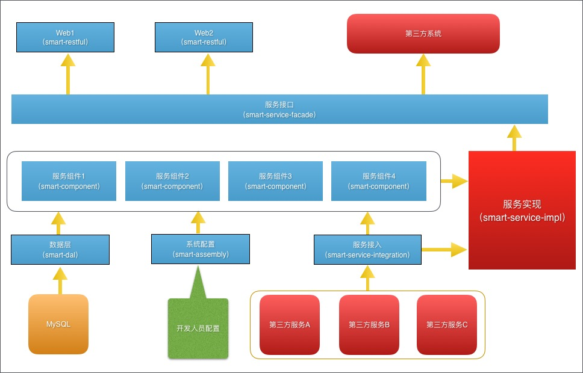

#smart-boot

##工程结构

- smart-assembly   
用于集中管理smart-boot工程中各Spring配置文件所需的属性配置
- smart-dal  
数据操作层bundle,实现数据存储读取操作。
- smart-service-integration  
与外部第三方系统对接的bundle，以供smart-boot调用第三方服务
- smart-component  
组件bundle，遵循单一职责原则，向下对接smart-dal、smart-service-integration，向上为业务层smart-service-impl提供各组件式服务
- smart-service-facade  
定义smart-boot的服务接口，一个独立的bundle,不依赖其他模块。未来第三方系统可通过该bundle提供的接口调用服务
- smart-service-impl  
该bundle通过引用smart-componet提供的各组件用于实现smart-service-facade中定义的接口。对于私有服务可直接在本bundle中定义接口，无需放置在smart-service-facade中.  
>为方便使用，也可直接调用smart-service-integration中提供的服务

- smart-shared  
该bundle完全独立于业务，主要用于提供一下工具类，可被任一bundle引用
- smart-restful  
Web层，仅负责前后端的数据交互，不建议在该bundle中进行复杂的业务处理，应统一交由smart-service-impl处理

##运行系统
dbapi-restful模块中运行BootStrap.java

##日志系统log4j2
### 为什么选用log4j2?  
1. Apache Log4j 2 is an upgrade to Log4j that provides significant improvements over its predecessor, Log4j 1.x, and provides many of the improvements available in Logback while fixing some inherent problems in Logback's architecture. 一句话总结，官方号称log4j2比log4j和logback都牛逼.
2. 配置简单集中，修改dbapi-assembly中的log4j2.xml即可实现整个工程的日志管理。

##生成maven archetype
mvn archetype:create-from-project
Then move to that generated directory and call mvn install on the created archetype.

已生成现成的archetype，参见[smart-boot-archetype](https://git.oschina.net/smartdms/smart-boot-archetype)

